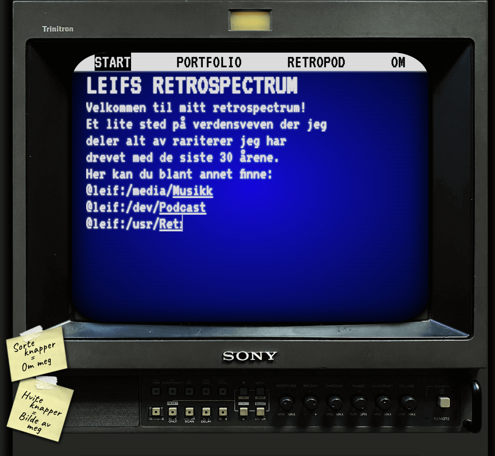

## Leifs Retrospectrum

## Table of Contents

- [About the Project](#about-the-project)
- [Features](#features)
- [Technology Used](#technology-used)
- [Design and Responsiveness](#design-and-responsiveness)
- [Resources Used](#resources-used)
- [Contributors](#contributors)
- [License](#license)

## About the Project

This website is a tribute to retro computers and gaming, created as part of an Inclusive Web Design assignment at OsloMet. The project was a collaborative effort by three students, with the majority of the web development work done by me. The content is based on one of the group members, Leif, and his love for retro computers. The goal was to present his portfolio in a way that truly reflects the retro aesthetic.

## Features

- **Sound Effects:** Plays an old computer startup sound when the user clicks anywhere on the site, enhancing the retro feel.
- **Retro Design:** The site is centered around an image of a Sony Trinitron CRT monitor, a highly regarded item among retro enthusiasts.
- **Famous Quotes:** Includes quotations from famous computer geeks over the years.
- **Responsive Layout:** Designed with mobile-first approach and adjusted for larger screens.
- **Interactive Elements:** Hidden sections that can be revealed by clicking on monitor buttons.
- **Podcast Promotion:** Dedicated page for "Retropod," featuring playable podcast episodes via SoundCloud iframes.

## Technology Used

- **HTML5:** For structuring the webpage content.
- **CSS:** For styling and layout, including CSS Grid, relative, and absolute positioning.
- **JavaScript:** For interactive elements and sound effects.
- **SoundCloud API:** For embedding playable podcast episodes.

## Design and Responsiveness

The website's design is heavily influenced by the aesthetics of 1980s retro computers. It uses a monospaced font and includes text shadowing and filters to mimic the look of old computer displays. Although these design choices might affect text readability, they serve to create an authentic retro feel. The website uses a combination of CSS Grid, relative, and absolute positioning to achieve the desired layout. Special care was taken to ensure the site is responsive and looks good on both mobile devices and larger screens.

### Resources Used

- **Images:** [Sony Trinitron monitor](https://www.reddit.com/r/crtgaming/comments/i840fc/i_havent_checked_out_yet_and_my_heart_is_pounding/), [Post-it note](https://www.nicepng.com/ourpic/u2q8a9w7i1a9r5t4_sticky-note-png-sticky-notes-transparent-png/)
- **Sound Compression:** [media.io](https://www.media.io/audio-compressor.html)
- **Image Compression:** [tinypng.com](https://tinypng.com/)
- **HTML & CSS Validation:** [W3C HTML Validator](https://validator.w3.org), [W3C CSS Validator](https://jigsaw.w3.org/css-validator/)
- **Fonts:** [Google Fonts](https://fonts.google.com/)
- **Accessibility Checker:** [AChecker](https://achecker.achecks.ca/checker/index.php)
- **Podcast Embedding:** [SoundCloud API](https://developers.soundcloud.com/)

## Contributors

- [LKielland](https://github.com/LKielland)
- [wiikh](https://github.com/wiikh)
- [pholdahl](https://github.com/pholdahl)

## License
This project is licensed under the MIT License.
